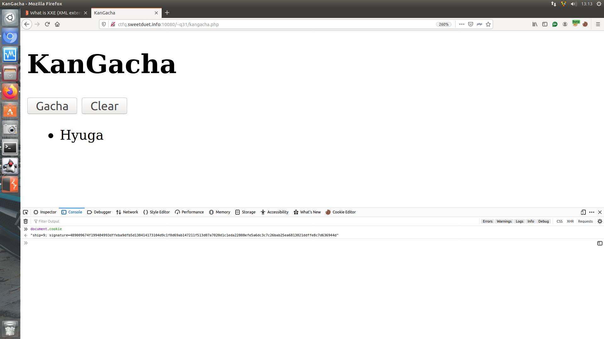
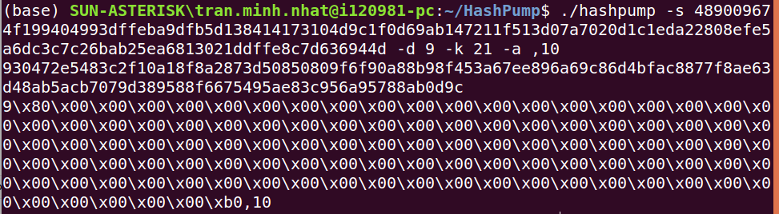
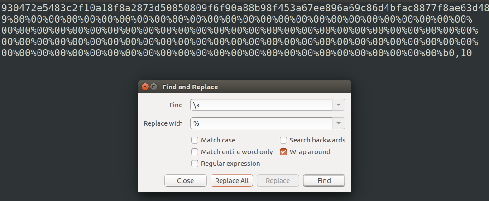
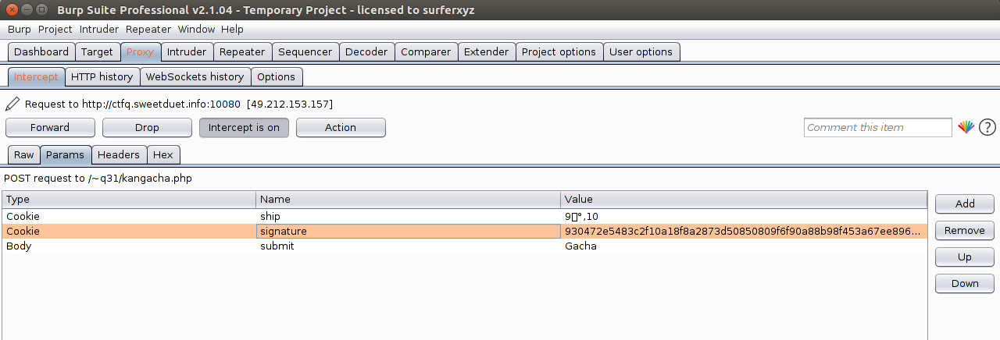
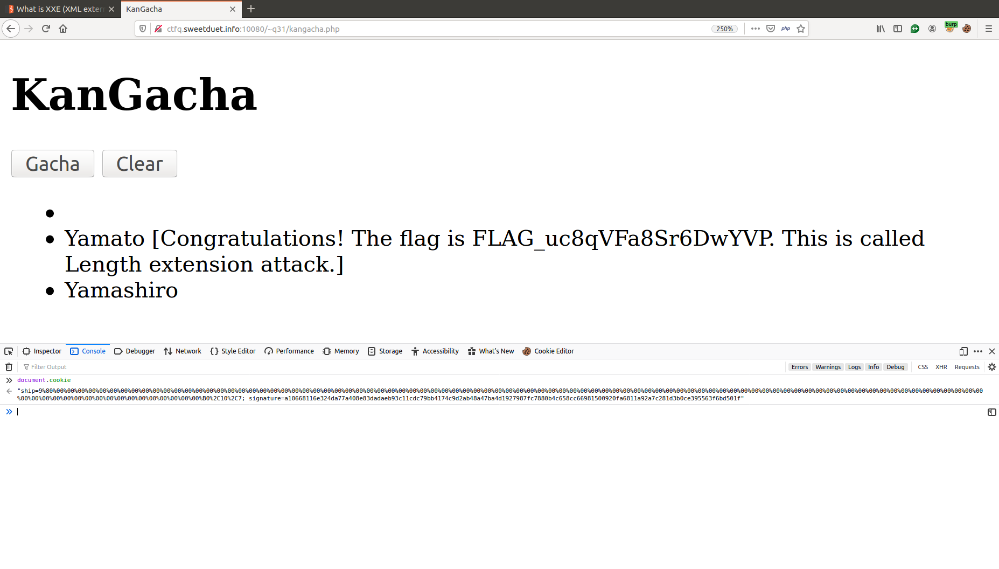

# Bài 2

Source code cho thấy web sẽ đọc input và so sánh với password lưu trên server bằng hàm strcasecmp.

Flag thì có dạng FLAG_???????????????? với mỗi dấu '?' tương ứng với 1 ký tự trong khoảng A-Za-z.<br>
Brute flag thì không thể vì sẽ có 16^52 flag 
-> Tìm cách khác để  strcasecmp($_POST['password'], $password) trả về 0.<br>

Các hàm so sánh string trong php có một lỗi khi tham số truyền vào là 1 mảng.<br>
```php
$fields = array(
    'id' => '127.0.0.1',
    'ps' => 'bar'
);
$a="danux";
 if (strcmp($a,$fields) == 0){
        echo " This is zero!!";
 }
 else{
       echo "This is not zero";
}
```
Lúc này sẽ có warning về việc strcmp nhận string nhưng tham số thứ 2 lại là mảng.<br>
Tuy nhiên, biểu thức trong if vẫn trả về **true**.

Tận dụng lỗi này, có thể dùng burpsuite để bắt request lên server và đổi input thành mảng rồi gửi lên.<br>


Click forward để gửi request đã sửa lên server.<br>
Lúc này **strcasecmp($_POST['password'], $password) == 0** trả về true, s

Flag: **FLAG_VQcTWEK7zZYzvLhX**

# Bài 3

Đọc source code thấy được:
- Biến **salt** chứa flag
- Mỗi khi ấn submit thì sẽ random từ 0 ~ 9
- Con số random được sẽ được nối thêm vào cookie ship, đi kèm 1 dấu ',' ở trước
- Server tính giá trị cookie signature bằng cách Hash(salt||cookie)
- Trước khi in ra danh sách các tàu, server sẽ kiểm tra lại xem Hash(salt||cookie) === signature hay không
- Nếu đúng thì sẽ in ra danh sách các tàu

Để ý thấy nếu in ra tùa yamato, tương đương với trong cookie phải có số 10. 
Nhưng server chỉ random các tàu 0 ~ 9 mà thôi.<br>
=> Cần tìm cách chèn thêm ",10" vào cookie, đồng thời tính đc signature = Hash(salt||ship||",10") rồi gửi request lên server.

Ở đây server sử dụng thuật toán kiểm tra MAC, thuật toán này có thể vượt qua bằng cách sử dụng kỹ thuật
Hash Length Extension Attack với tool HashPump.


-> gacha 1 lần để lấy data và signature <-

-> chạy tool HashPump để ra data chứa ",10" và signature mới <-

-> encode html trước khi gửi request lên <-

-> gacha lần nữa, bắt request và sửa cookie <-

-> forward lên ta được flag <-

Flag: **FLAG_uc8qVFa8Sr6DwYVP**
