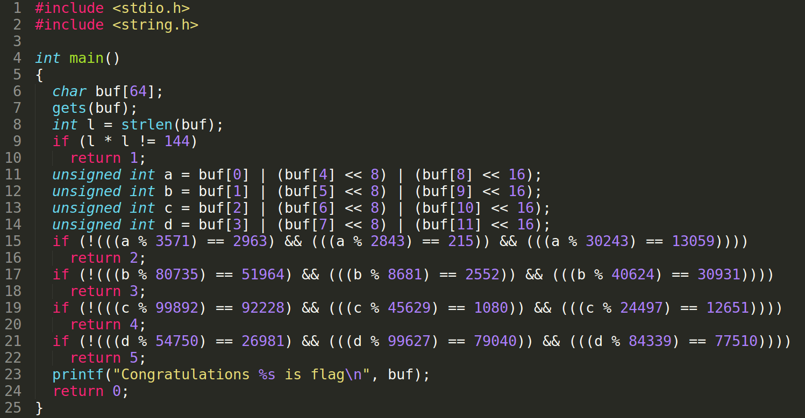

# Bài 4

(insert cái ảnh vào nhìn cho dễ)

Đoạn code này có 5 cái if cần chú ý, đó là các điều kiện if dẫn đến return 1, 2, 3, 4 và 5.

if 1 -> flag có 12 ký tự 

4 biến a, b, c, d được gán bởi giá trị của phép or 3 ký tự trong flag:
- a = buf[0] | (buf[4] << 8) | (buf[8] << 16)
- b = buf[1] | (buf[5] << 8) | (buf[9] << 16)
- c = buf[2] | (buf[6] << 8) | (buf[10] << 16)
- d = buf[3] | (buf[7] << 8) | (buf[11] << 16)

Vì sử dụng phép dịch trái 8 hoặc 16 bit nên thực tế giá trị của 4 biến a, b, c, d khi chuyển sang ascii 
sẽ chính là thứ tự ngược lại của các ký tự trong phép or.

VD như sau:
- Cho 1 ký tự 'a', 'b' và 'c'
- Biểu diễn của chúng trong dạng nhị phân lần lượt như sau: 01100001, 01100010 và 01100011
- Sử dụng phép dịch trái 8 bit với 'b' ta được: 01100010 00000000 
(tương tự với dịch trái 16 bit sẽ tạo thêm 8 bit 0 ở phía bên phải)
- Như vậy biểu diễn nhị phân của x = a | (b << 8) | (c << 16) là: 01100011 01100010 01100001

4 cái if 2, 3, 4, 5 còn lại để check giá trị của a, b, c, d mà thôi. Chỉ cần brute từ 1 đến 4.294.967.295 là được, chỉ có 1 số thỏa mãn 3 cái điều kiện so sánh trong if thôi nên tìm đc là break luôn. Cứ thế 4 lần ta được:
- a = 4730967 <=> H0W 
- b = 3362099 <=> 3M3
- c = 7484236 <=> r3L
- d = 3366731 <=> 3_K

=> Flag: **W3LK0M3_H3r3**
